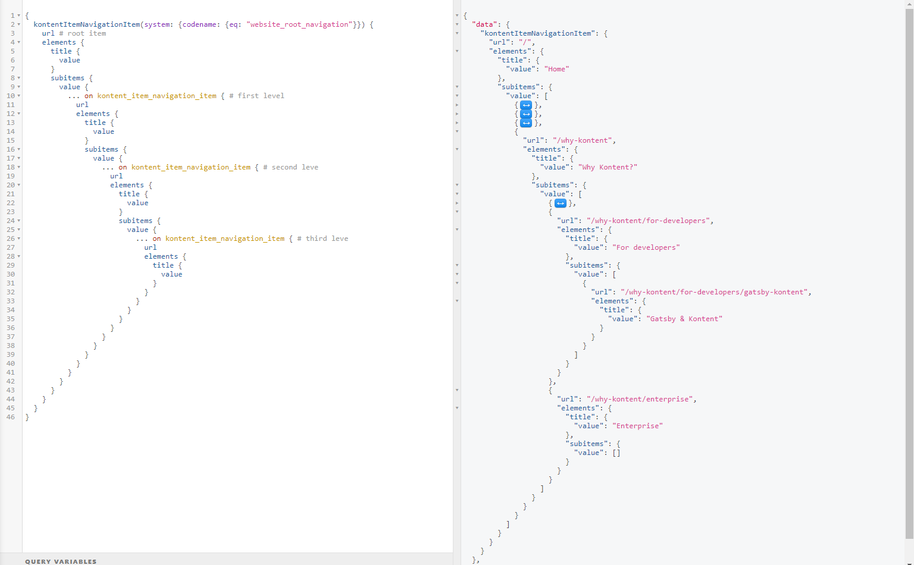
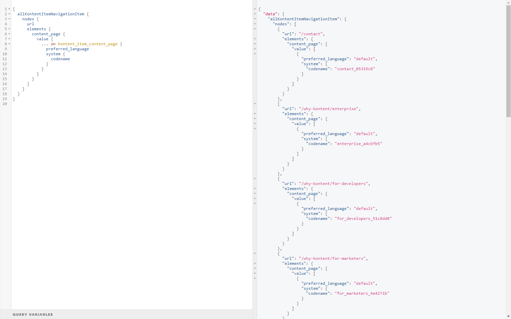
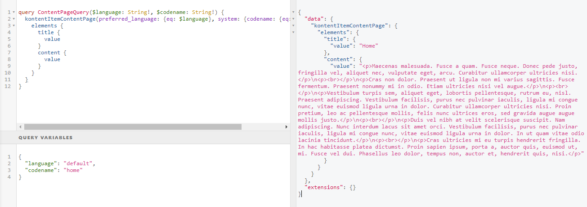
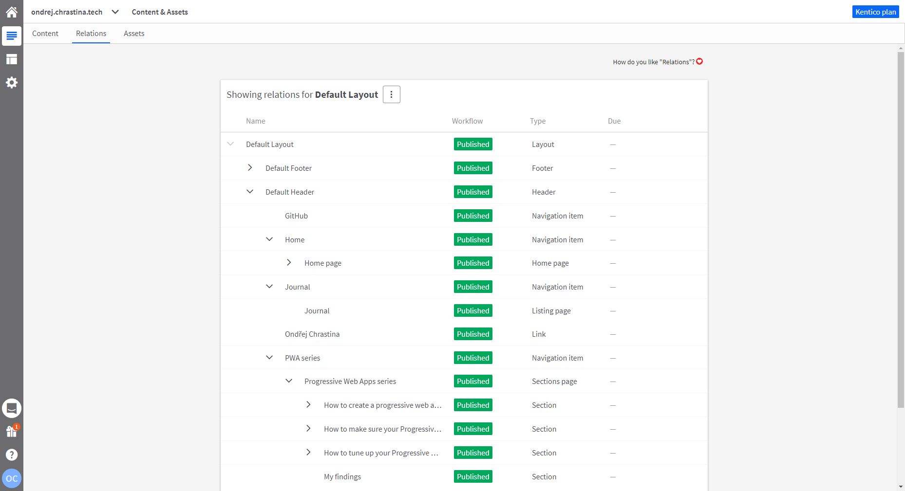

# Gatsby Navigation Example

[](https://app.netlify.com/sites/kontent-gatsby-example-navigation/deploys)

Site showcasing, how to model the menu in Kentico Kontent and the use this model in the Gatsby application to render a menu and its linked content.

This showcase extends originates from [Explicitly modeled navigation](https://docs.kontent.ai/tutorials/write-and-collaborate/structure-your-content/manage-navigation-menus#a-c-explicitly-modeled-navigation) approach and adds some Gatsby specific steps.

## Get started

:warning: Before running any of the following scripts locally ensure the site is using the latest dependencies

```sh
# In the root folder of this repo
yarn # install all required packages
yarn build # build the latest version of the local packages
```

### Develop site

```sh
# open the /example/navigation folder
cd examples/navigation
yarn develop # runs `gatsby develop` command
```

Now you could browse the site on <http://localhost:8000> and see GraphiQL explorer on <http://localhost:8000/___graphql>.

## Content modeling

This section explains how the content is modeled. You could follow next section of [Import the content to your on Kontent project](#Import-site-content-to-your-Kontent-project) and explore the models by your own.

### Kontent content

First of of all it is required to create two content types:

- `Navigation item` - which will represent an item in the menu of your website
- `Content page` - this content type represent ty content you want to display on the website

#### Navigation item content type

This content type - `Navigation item` - has following structure:

- Title - **Text** element
- Slug - **URL slug** element - auto-generated from title
- Subitems - **Linked items** element - content type limited to `Navigation item`
- Content - **Linked items** - content type limited to contain at most one item to of type `Content page`

This content type represent and item in the menu in your website. You could have multiple menus on your site, in that case you could use multiple "root" navigation items to model this situation.

In case you want to link external URL to different domain, it is possible to extend the content type by **Text** element called i.e. _External URL_.

#### Generic Content type

This content type - `Content page` - has following structure:

- Title - **Text** element
- Content - **Rich text** element

This content type is used as a content container, it could be reused across multiple channels.

In this example, there is only one content model holding the content, but you could of course use multiple types for content modeling. All of them then could be allowed in _Content_ element of the `Navigation item` content type.

## Gatsby data consumption

There are two main parts that need to be generated:

- Menu - render the menu component with proper routes
- Pages - register page components under the menu routes

### Menu

#### Add a route information (`url` field) to the `Navigation item`

It is required to [extend the GraphQL schema](https://www.gatsbyjs.org/docs/schema-customization/) of the `Navigation item` content type and build up the routes from the _Slug_ elements in `Navigation item` - the new field is named `url` in the showcase.

The idea is to traverse **bottom-up** the navigation tree for every `Navigation item` to it's parent modeled by `Subitems` element and gather it _Slug_ element i.e.:

- from `gatsby-kontent` > `for-developers` > `why-kontent`
- to `/why-kontent/for-developers/gatsby-kontent`

This extension is showcased in [gatsby-node.js's createSchemaCustomization](./gatsby-node.js#L7). This is a similar [approach that Wordpress is using](https://github.com/gatsbyjs/gatsby/issues/3954#issuecomment-599256320)

#### Use the route information (`url` field) to create menu component

Create a menu component that is using the `url` field to build up the simple menu. In the [showcase menu component](./src/components/complex-menu.js) there is a query loading three levels of the menu.



#### Use the route information (`url` field) to create pages

Use the precomputed `url` field to [programmatically create pages using Gatsby API](https://www.gatsbyjs.org/tutorial/part-seven/#creating-pages).

In [gatsby-node's createPages](./gatsby-node.js#L56) live-cycle API to query all `Navigation items` and register their then new pages under the route from `url` field and pass `preffered_language` and item's `codename` as a context property to [create page base on the template](https://www.gatsbyjs.org/blog/2019-05-02-how-to-build-a-blog-with-wordpress-and-gatsby-part-3/#adding-pages-to-gatsby-nodejs).



### Pages

The last step is to use contextual data to query content you want to render under specific route. Showcase contain only one type of the generic content item `Content page`. For this type it is required to create a template ([`/templates/content-page.js`](./src/templates/content-page.js)).



## Import site content to your Kontent project

If you want to check the content in your own project, you could use following guide:

1. Go to [app.kontent.ai](https://app.kontent.ai) and [create empty project](https://docs.kontent.ai/tutorials/set-up-kontent/projects/manage-projects#a-creating-projects)
1. Go to "Project Settings", select API keys and copy `Project ID`
1. Install [Kontent Backup Manager](https://github.com/Kentico/kontent-backup-manager-js) and import data to newly created project from [`kontent-backup.zip`](./kontent-backup.zip) file (place appropriate values for `apiKey` and `projectId` arguments):

   ```sh
   npm i -g @kentico/kontent-backup-manager

   kbm --action=restore --apiKey=<Management API key> --projectId=<Project ID> --zipFilename=kontent-backup
   ```

   > Alternatively, you can use the [Template Manager UI](https://kentico.github.io/kontent-template-manager/import-from-file) for importing the content.

1. Go to your Kontent project and [publish all the imported items](https://docs.kontent.ai/tutorials/write-and-collaborate/publish-your-work/publish-content-items).

## [More complex example](https://github.com/Simply007/Simply007.github.io#setup)

This showcase shows the basics for the menu modeling. If you want to take a look to [**more complex setup**](https://github.com/Simply007/Simply007.github.io#setup) you should continue to [ondrej.chrastina.tech](https://ondrej.chrastina.tech) [[`source`](https://github.com/Simply007/Simply007.github.io)]. This website is applying [more complex approaches](https://github.com/Simply007/Simply007.github.io#Setup).



### External URLs

As mentioned before, the navigation item could be extended by `External URL` field. [This field is then used instead of `url` field](https://github.com/Simply007/Simply007.github.io/src/components/Menu.js).

### Multiple content pages

There are multiple content pages used as the content container. Namely `Home page`, `Sections page`, `Listing page`. These content containers are using [different templates](https://github.com/Simply007/Simply007.github.io/blob/source/gatsby-node.js) when registering the page components under the routes ([templates](https://github.com/Simply007/Simply007.github.io/tree/source/src/templates)).

#### Listing content page

One of the content container types is `Listing items`, this type allows to select content type(s) that is/are then used to determine what is about to be queried in the page. To model it in Kontent [Type selector custom element](https://github.com/Simply007/kontent-custom-element-type-selector) is used and then in the application. Then when the application is registering the page components ir loads detail items and [register them under their own route](https://github.com/Simply007/Simply007.github.io/blob/source/gatsby-node.js#L115) with [detail component template](https://github.com/Simply007/Simply007.github.io/blob/source/src/templates/journal-item.js).

## Set up Preview URLs

If you are using complex and nested menu navigation in combination with [Preview URLs](https://docs.kontent.ai/tutorials/develop-apps/build-strong-foundation/set-up-preview#a-set-up-content-preview-in-your-project) you might need to have a way to map the "preview" URL to the one you have built using schema customization because in the context of Preview URLs there is only `url slug`, `codename`, `language` and `item ID`, but not the information of other elements, or their relationship.

> ⚠ Render "preview pages" only in development environment ([`NODE_ENV` is set to `development`](https://www.gatsbyjs.com/docs/environment-variables/#reserved-environment-variables)) and for the pages  that requires preview to prevent build time performance degradation.

In a nutshell, you want register routes endpoint like i.e. `/preview/<LANGUAGE>/<CODENAME>` by hooking to [`createPages`](https://www.gatsbyjs.com/docs/node-apis/#createPages) Gatsby Node API method and use one of the following approaches to map your preview URLs to the publish URLs.

- [`createPage`](https://www.gatsbyjs.com/docs/actions/#createPage)
  - Just use the same construct, [that is already used for creating production pages](./gatsby-node.js#L82)
  
  ```js
  if(process.env.NODE_ENV === 'development') {
      createPage({
        path: `/preview/page/${contentPage.preferred_language}/${contentPage.system.codename}`,
        component: require.resolve(`./src/templates/content-page.js`),
        context: {
          language: contentPage.preferred_language,
          codename: contentPage.system.codename,
        },
      })
    }
  ```

- Use some React based approach to handle redirection
  - Choose one compatible with [Gatsby Routing mechanism](https://www.gatsbyjs.com/docs/routing/), like `client-only` routes using `@react/router`
- [`createRedirect`](https://www.gatsbyjs.com/docs/actions/#createRedirect)
  - Mind the description of the action "Server redirects don’t work out of the box".
  - Also defining redirects on client side (option `redirectInBrowse`) lead to small delay/blink on development server from 404 to redirected page.
