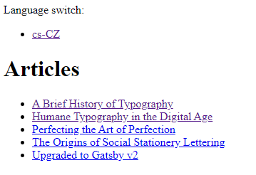
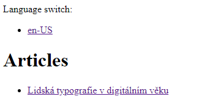
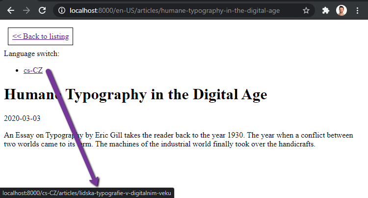
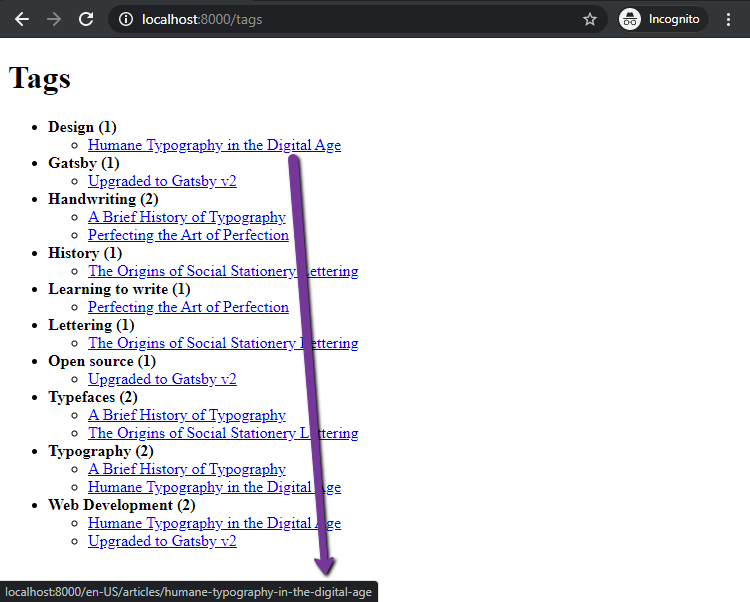
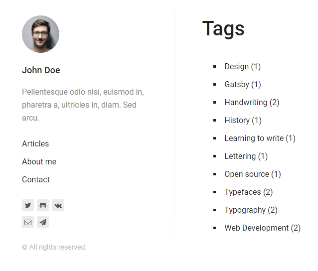

# Gatsby Relationships Example

[](https://app.netlify.com/sites/kontent-gatsby-example-relationships/deploys)

The following example sites are showcasing the possibilities of [Gatsby Foreign keys Fields](https://www.gatsbyjs.com/docs/schema-customization/#foreign-key-fields) on some simple scenarios.

## Get started

⚠ Before running any of the following scripts locally ensure the site is using the latest dependencies

```sh
# In the root folder of this repo
yarn # install all required packages
yarn build # build the latest version of the local packages
```

### Develop site

```sh
# open the /example/relationships folder
cd examples/relationships
yarn develop # runs `gatsby develop` command
```

Now you could browse the site on <http://localhost:8000> and see GraphiQL explorer on <http://localhost:8000/___graphql>.

## Content modeling

This section explains how the content is modeled. You could follow to the next section ["Import the content to your on Kontent project"](#Import-site-content-to-your-Kontent-project) and explore the models on your own as well as the sample data based on it. Or you could create models manually to familiarize yourself with the Kontent user interface.

Once you create the content models, you could create content items based on these and the site would be capable to handle the content and render it.

### Kontent content models

Kontent project contains a simple article content base, that could be tagged. There are two content types `Article` and `Tag`. Kontent project is using two languages `en-US` and `cs-CZ` to showcase [Language variant relationships](#Language-variant-relationships).

#### Article content type

This content type - `Article item` - has following structure:

- Title - **Text** element
- Content - **Text** element
- Date - **Date & Title** element
- Slug - **URL slug** element - auto-generated from title
- Tags - **Linked items** element - content type limited to `Tag`

This content type represents an article, first four elements (`Title`, `Content`, and `Date`) are meant to be used for some sample content that should be displayed on site. The `Content` element is set to simple text because of simplicity. Rich text element type possibilities are described in [Resolution example](../resolution#readme). The `Slug` element is used to route registration. `Tags` element is modeled as Linked items element type because of [Linked from relationship](#Linked-from-relationship) example.

#### Tag content type

- Title - **Text** element
- Slug - **URL slug** element - auto-generated from title

This content type represents a simple tag for an article. An article could contain more than one. This tag is modeled because of [Linked from relationship](#Linked-from-relationship) example.

## Features

Following features are described on simple real-life use cases. All of them is using [Gatsby schema customization](https://www.gatsbyjs.com/docs/schema-customization) to connect GraphQL nodes among each other to achieve the queries simplify and  to make the site efficient.

Schema extension are being performed right in the web site source code (in [gatsby-node.js](./gatsby-node.js) file) using [`createSchemaCustomization`](https://www.gatsbyjs.com/docs/node-apis/#createSchemaCustomization) method.

If you want to separate this logic, it is possible to create a [local Gatsby plugin](https://www.gatsbyjs.com/docs/creating-a-local-plugin/) and define these customization there, as it is showcased in the [Kontent Lumen starter](https://github.com/Kentico/gatsby-starter-kontent-lumen/tree/master/plugins/kontent-used-by-content-items), just use [`createResolvers`](https://www.gatsbyjs.com/docs/node-apis/#createResolvers) method for the customizations. If you want to re-use this code, you could [publish the plugin to the npm](https://www.gatsbyjs.com/contributing/submit-to-plugin-library/) and then re-use it.

> In case you published your schema extension bound to Kontent GraphQL nodes feel free to raise an issue/pull request with plugin description and we are happy to mention it here!

### Language variant relationships

The example is describing possibility of creating relationships among language variants. This relationship could be ensured by [extending schema definition](https://www.gatsbyjs.com/docs/schema-customization).

> If you wish to use the Gatsby for bigger multilingual, take a look to the [blog post "How to Build Multilingual Sites with Gatsby"](https://www.gatsbyjs.com/blog/2020-02-19-how-to-build-multilingual-sites-with-gatsby)

Actual use case is to extend `Article` by two fields: `fallback_used` and `other_languages`.

- `fallback_used` is a `Boolean` field saying it the specified language variant [used language fallback](https://docs.kontent.ai/tutorials/manage-kontent/projects/set-up-languages#a-language-fallbacks) or not.
- `other_languages` is a `[kontent_item_article]` type, which means it is an array of other GraphQL nodes with type `kontent_item_article`, which is the type representing `Article` (you could find type name in `internal.type` field or you could use `getKontentItemNodeTypeName` method from Kontent Gatsby source plugin if you know content type codename).

#### Language fallback extension showcase

For the real-life example, there is a listing ot the articles registered on the `/articles` route. This page is registered in `gatsby-node` file using [`createPages`](https://www.gatsbyjs.com/docs/node-apis/#createPages) API method to register the page using [articles.js](./src/templates/articles.js) template. This template is using `fallback_used` element to filter out the listing.

So in english (en-US) route `/en-US/articles`, you will see all articles:



But in czech version (cs-CZ), there is only one article listed because the only article is translated into Czech language.



#### Language selector

The `other_languages` field is used in Article detail.

If you open up article detail ([article-detail.js](./src/templates/article-detail.js) template), the `other_languages` field is used to load data from the other language variants (URL slug value) to create language selector.

You could see the language selector on the article that has other language variant _Humane Typography in the Digital Age_:



#### Implementation details

As mentioned, to [`createSchemaCustomization`](https://www.gatsbyjs.com/docs/node-apis/#createSchemaCustomization) method is used to create a relationships. In this case the method used to link language variants is named `linkLanguageVariants` and [this is its source code](./example-languages-variants.js). This method basically using `buildObjectType` method to extend the type specified by the method argument. The GraphQL type name is generated from content type codename using `getKontentItemNodeTypeName` method from source plugin.

Method responsible for filling the fields with data is a called `resolve`. For `fallback_used` it is pretty straightforward, but for `other_languages` it [is more complicated](./example-languages-variants.js#L27). Take a look to the code comments for possible modifications that changes what data is being retrieved to the field.

Once you extend the schema, it is possible to query the data using GraphQL like that:

```gql
{
  allKontentItemArticle {
    nodes {
      fallback_used
      preferred_language
      system {
        language
        codename
      }
      elements {
        title {
          value
        }
      }
      other_languages {
        fallback_used
        preferred_language
        system {
          language
          codename
        }
        elements {
          title {
            value
          }
        }
      }
    }
  }
}
```

### Linked from relationship

Reverse link resolution relationship could be ensured by the schema definition as well.

Implementation is stored in [`example-used-by-content-item-link.js`](./example-used-by-content-item-link.js) file. This implementation is called in gatsby node in this form:

```js
linkUsedByContentItems(api, "article", "tag", "tags", "used_by_articles")
```

And it basically says: _I have a linked items element linking `article` content type with `tag` content type. And this element has codename `tags`. Make a field `used_by_articles` in `tag` content type with back references to the `articles`.

And then it is easy to load information about tags and articles linked to them [source](./src/pages/tags.js):

```gql
{
    allKontentItemTag(filter: {preferred_language: {eq: "en-US"}}) {
      nodes {
        elements {
          title {
            value
          }
        }
        used_by_articles {
          elements {
            title {
              value
            }
            slug {
              value
            }
          }
        }
      }
    }
  }
```



> This approach is also used in [Gatsby Starter Lumen for Kontent](https://github.com/Kentico/gatsby-starter-kontent-lumen/tree/master/plugins/kontent-used-by-content-items) if a form of local plugin and then [it is used for tags listing to determine number of linked articles](https://gatsby-starter-kontent-lumen.netlify.app/tags/).



## Import site content to your Kontent project

If you want to import content types with the sample content in your own empty project, you could use following guide:

1. Go to [app.kontent.ai](https://app.kontent.ai) and [create an empty project](https://docs.kontent.ai/tutorials/set-up-kontent/projects/manage-projects#a-creating-projects)
1. Go to "Project Settings", select API keys and copy `Project ID`
1. Install [Kontent Backup Manager](https://github.com/Kentico/kontent-backup-manager-js) and import data to newly created project from [`kontent-backup.zip`](./kontent-backup.zip) file (place appropriate values for `apiKey` and `projectId` arguments):

   ```sh
   npm i -g @kentico/kontent-backup-manager

   kbm --action=restore --apiKey=<Management API key> --projectId=<Project ID> --zipFilename=kontent-backup
   ```

   > Alternatively, you can use the [Template Manager UI](https://kentico.github.io/kontent-template-manager/import-from-file) for importing the content.

1. Go to your Kontent project and [publish all the imported items](https://docs.kontent.ai/tutorials/write-and-collaborate/publish-your-work/publish-content-items).

### Connect the site to a custom project

Open the `gatsby-config.js` file and set the following properties for `@kentico/gatsby-source-kontent` plugin:

- `projectId` from *Project settings > API keys > Delivery API > Project ID*
- `languageCodenames` from *Project settings > Localization*
