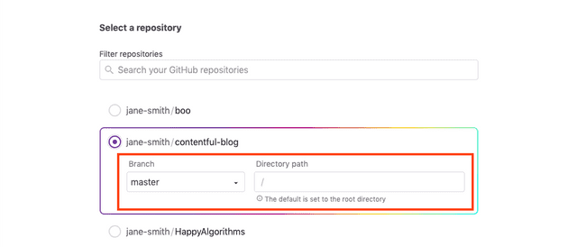

# Getting started with Gatsby Cloud and Kontent

Learn how to connect Gatsby Cloud with Kontent

## What are Gatsby Cloud and Kontent, and why use them together?

[Kontent](https://kontent.ai) is a headless CMS that content editors can use to edit and publish content. Gatsby Cloud allows you to integrate your site with Kontent in order to run performant builds and preview content changes made in the CMS before publishing

## Setting up a Kontent and Gatsby site

First, you’ll need a Gatsby site with a [gatsby-source-kontent](https://www.gatsbyjs.org/packages/@kontent/gatsby-source-kontent) source plugin pulling data from Kontent. If you haven’t set that up yet, you can quickly create a new project by using the [gatsby-starter-kontent-lumen](https://github.com/Kentico/gatsby-starter-kontent-lumen) and signing up for an account at app.kontent.ai.

## Signing in to Gatsby Cloud

Select `Sign in with GitHub`. You’ll be asked to authorize the Gatsby Cloud app with your GitHub account. If you need to request access to one or more repositories, you can click "request access" here or later, when creating an instance.

Once signed in, configuring Gatsby Cloud with Kontent requires several steps that are walked through below.

## Creating an instance

Once you’ve authenticated with Cloud and GitHub, you can create an instance from the ["Create a new Gatsby Cloud site"](https://gatsbyjs.com/dashboard/sites/create) page.

Use the "I already have a Gatsby site" flow to manually integrate your site.

Pick your Gatsby site from the list of GitHub repositories. You can use the search input to narrow down the list.

If you don’t see your site, it might be because it belongs to a GitHub organization, rather than your personal account. You can connect a new GitHub Organization.

*Note: Repositories must contain one Gatsby project configured at their root to be enabled. Gatsby Cloud works best with Gatsby version 2.20.36 and higher.*

## Select branch and publish directory

You’ll need to select a branch and then indicate the publish directory where the gatsby-config.js lives. If you leave the field blank, it defaults to the root of the site.

Once the branch and base directory are correct, select "Next".

## Create the instance

## Manual Integration

First, click "Skip this step" to configure Kontent manually.

Gatsby Cloud will automatically try and detect environment variables necessary in your `gatsby-config.js`. However — consider adding any additional variables that automatic detection may have missed. See ["Setting up Environment Variables"](https://www.gatsbyjs.com/docs/agility-cms/getting-started/#setting-up-environment-variables) for more info.

Note that you will be able to add, delete, or update these later on in "Site Settings".

Once you’ve added the necessary environment variables, you can press "Create site" which will create your instance in Gatsby Cloud!

## Site is Created

After following the "Automatic Integration" or "Manual Integration" flow you now have an instance of Gatsby Cloud configured with environment variables and a provided Gatsby Preview instance you can share with your team. Woo-hoo!

## Setting up Environment Variables

An environment variable references a value that can affect how running processes will behave on a computer, for example in staging and production environments. You must save environment variables in Gatsby Cloud to authorize your instance to pull source data from Kontent.

**You will need to add into Gatsby Cloud any environment variable required for your app to run, such as deployment or test environment configuration settings.**

**You will also need to add in the following Gatsby Cloud-specific environment variables:**

In your Kontent project, on the "Project settings" tab, click on "API Keys".

// TODO API section

You will need to grab the following values from this window:

* Project ID
* Preview API key (Primary or Secondary)

In your Kontent project, on the "Localization" tab get codenames of the localizations for your project.

* Language codenames (i.e. `en-US, cs-CZ`)

These values will map to the following environment variables in Gatsby Cloud (assuming you are using the [gatsby-starter-kontent-lumen](https://github.com/Kentico/gatsby-starter-kontent-lumen) or a similar configuration):

Value | Environment Variable Name
------------ | -------------
Project ID | KONTENT_PROJECT_ID
Preview API key | KONTENT_PREVIEW_KEY
Language codenames | KONTENT_LANGUAGE_CODENAMES

You will want to set KONTENT_PREVIEW_ENABLED to `true` for Preview and `false` for Builds.

**Click `Save` once you’ve entered you’re variables**

Select `Create Site`

Select `Create Site` and wait for the first preview instance to be created.

## Webhooks: Configuring your Gatsby site to work with Gatsby Cloud

### Setting up a webhook in Kontent

To make a connection between Kontent and Gatsby Cloud for your site, you’ll need to configure a webhook in Kontent so that content changes can be pushed to Gatsby Cloud.

You can add and edit necessary webhook information in two places in Gatsby Cloud:

* During the “Create a new Site” process
* After setting up an instance, on that instance’s Settings page

You’ll set up two webhooks in Kontent: one for Gatsby Preview, and one for Gatsby Builds!

### Agility CMS documentation on webhooks

For full documentation on setting up webhooks in Kontent, see their [webhook documentation](https://docs.kontent.ai/reference/webhooks-reference).

### Adding a Preview Webhook

Navigate to your Gatsby Cloud instance, and press "Site Settings". Copy the Preview Webhook on this page.

**Open Kontent app, go to "Project settings" tab and select "Webhooks"**

Select "Create new Webhook".

Name the webhook and paste the Preview webhook copied from the Gatsby Cloud Dashboard to URL address.

And select only triggers in section "DELIVERY PREVIEW API TRIGGERS"

* Create or Update
* Delete

Click Save

Your Preview webhook is now ready! When you change your content in Kontent, your Gatsby Preview will update!

### Adding a Build Webhook

Navigate to your Gatsby Cloud instance, and press "Site Settings". Copy the Build Webhook on this page.

**Open Kontent app, go to "Project settings" tab and select "Webhooks"**

Select "Create new Webhook".

Name the webhook and paste the Build webhook copied from the Gatsby Cloud Dashboard to URL address.

And select only triggers in section "DELIVERY API TRIGGERS"

* Publish
* Unpublish

Click Save

Your Build webhook is now ready! When you publish/unpublish content in Kontent, your Gatsby Build will update!

## Setting the Gatsby Preview Domain for Kontent

TODO

## Wrapping Up

At this point, you now have a Kontent instance configured to best support Gatsby Cloud. Edit content, click the Preview button and watch it appear live in Gatsby Cloud!