# Getting started with Gatsby Cloud and Kontent

Learn how to connect Gatsby Cloud with Kentico Kontent based Gatsby site.

In this tutorial you will discover how to easily integrate site sourced by Kentico Kontent with Gatsby Cloud.

You will

- Create a website using data from Kentico Kontent.
- Store its source Code on GitHub.
- Register this Github repository in Gatsby Cloud.
- Configure Kentico Kontent webhooks to notify Gatsby Cloud about the content changes on preview environment as well as on production.
- Configure preview URLs in Kentico Kontent.

## What are Gatsby Cloud and Kontent, and why use them together

[Kontent](https://kontent.ai) is a headless CMS that content editors can use to edit and publish content. It is a Content-as-a-Service solution that gives enterprises control over their entire content lifecycle in a single unified environment. Gatsby Cloud allows you to integrate your site with Kontent in order to run performant builds and preview content changes made in the CMS before publishing.

## Setting up a Kontent and Gatsby site

First, you’ll need a Gatsby site with a [gatsby-source-kontent](https://www.gatsbyjs.org/packages/@kentico/gatsby-source-kontent) source plugin to pull data from Kontent. If you haven’t set that up yet, you can quickly create a new project by using the [gatsby-starter-kontent-lumen](https://github.com/Kentico/gatsby-starter-kontent-lumen) repository. ~~To achieve it, see the [Getting started](https://github.com/kentico/gatsby-starter-kontent-lumen#getting-started) tutorial.~~

> Note that source plugin version supporting Gatsby Cloud is in beta phase (internally called [`vNext`](https://github.com/Kentico/gatsby-source-kontent/tree/vNext/packages/gatsby-source-kontent#readme) version), so use the link to the development branch to [Getting started](https://github.com/Simply007/gatsby-starter-kontent-lumen/tree/vNext#getting-started) section. to be able to spin up project supporting Gatsby Cloud.

## Signing in to Gatsby Cloud

[Access Gatsby Cloud](https://gatsbyjs.com/dashboard/sites/create) and select **Sign in with GitHub**. You’ll be asked to authorize the Gatsby Cloud app with your GitHub account. If you need to request access to one or more repositories, you can click _request access_ now or later when creating an instance.

Once signed in, configuring Gatsby Cloud with Kontent requires several steps that are walked through below.

### Creating an instance

Start by [registering you GitHub repository](https://gatsbyjs.com/dashboard/sites/create).

Use the **I already have a Gatsby site** flow to manually integrate your site.

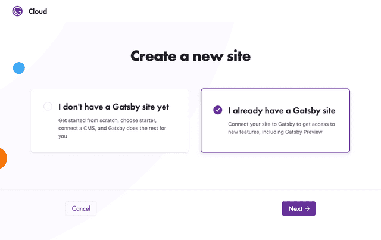

### Select an organization & repository

Pick your Gatsby site from the list of GitHub repositories.

If you don’t see your site, it might be because it belongs to a GitHub organization rather than your personal account. You can connect a new GitHub Organization.

_Note: Repositories must contain one Gatsby project configured at their root to be enabled. Gatsby Cloud works best with Gatsby version 2.20.36 and higher._

You’ll need to select a branch and then indicate the publish directory where the `gatsby-config.js` lives. If you leave the field blank, it defaults to the root of the site.

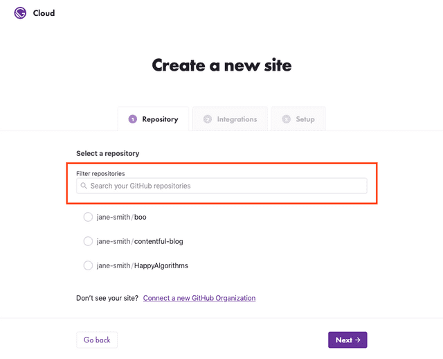

Once the branch and publish directory are correct, select **Next**.

### Create the instance

Click **Skip this step** to configure Kontent manually.

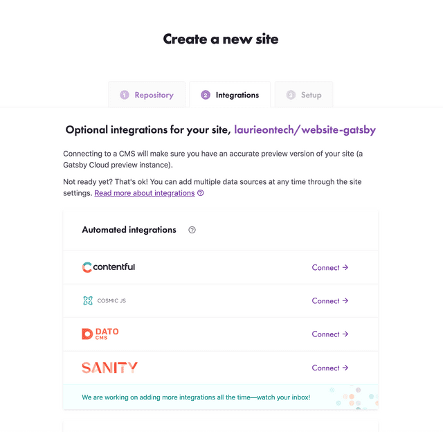

_Gatsby Cloud will automatically try and detect environment variables necessary in your `gatsby-config.js`. However — consider adding any additional variables that the automatic detection may have missed. See [Setting up Environment Variables](#setting-up-environment-variables) for more info. You'll be able to add, delete, or update these later on in your Site Settings._

### Setting up Environment Variables

An environment variable references a value that can affect how running processes will behave in a specific environment, such as staging and production environments. You must save your environment variables in Gatsby Cloud to authorize your instance to pull source data from Kontent.

First, open your Kontent project and go to **Project settings** > **API Keys**.
On the API keys screen, copy the values for **Project ID** and **Preview API key** (Primary or Secondary).

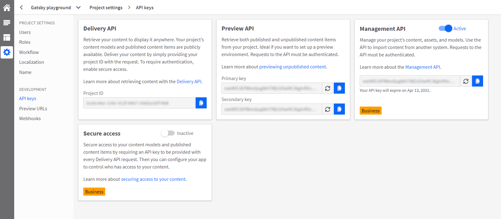

Then go to **Project settings** > **Localization** to get the codenames of your project languages.


The language codenames used in the [`gatsby-starter-kontent-lumen`](https://github.com/Kentico/gatsby-starter-kontent-lumen) sample app are `en-US,cs-CZ`.

| Value                           | Environment Variable Name  |
| ------------------------------- | -------------------------- |
| <YOUR_PROJECT_ID>               | KONTENT_PROJECT_ID         |
| <YOUR_PREVIEW_API_KEY>          | KONTENT_PREVIEW_KEY        |
| <YOUR_LANGUAGE1,YOUR_LANGUAGE2> | KONTENT_LANGUAGE_CODENAMES |

You will want to set `KONTENT_PREVIEW_ENABLED` to `true` for Preview and `false` for Builds.

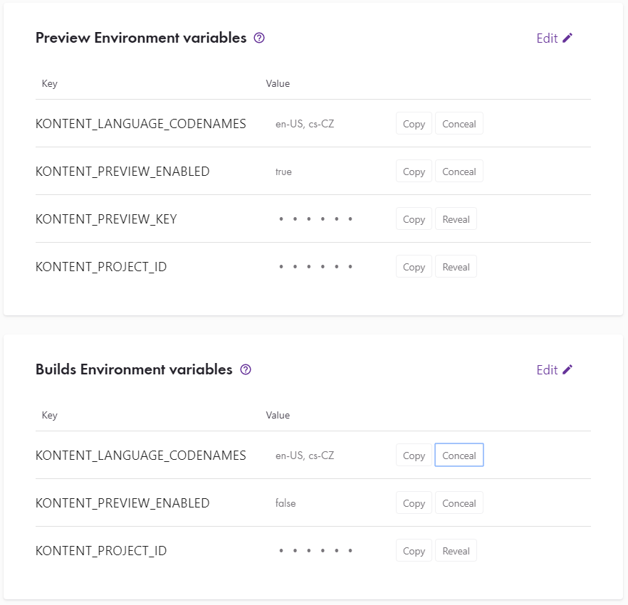

Once you’ve entered your variables, click **Save** and then **Create site**.

Go to the _Preview_ tab and wait for the preview instance to be created.

## Webhooks: Configuring your Gatsby site to be updated with content changes

To connect Kontent with your Gatsby Cloud instance, you’ll need to [configure a webhook](https://docs.kontent.ai/tutorials/develop-apps/integrate/webhooks#a-creating-a-webhook) in Kontent so that content changes can be pushed to Gatsby Cloud.

You’ll add two webhooks in Kontent: one for Gatsby Preview and another for Gatsby Builds.

### Adding a Preview Webhook

Navigate to your Gatsby Cloud instance and click **Site Settings**. Copy the _Preview Webhook_ on this page.

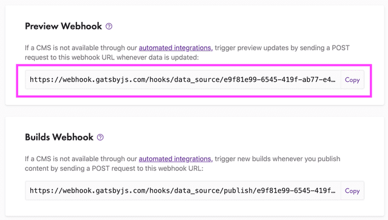

~~In your Kentico Kontent project, go to **Project settings** > **Webhooks** and click **Create new webhook**.~~


~~Name the webhook and paste the _Preview webhook_ into the URL address field.~~

~~In the webhook configuration, select the _Create or Update_ and _Delete_ triggers under DELIVERY PREVIEW API TRIGGERS.~~

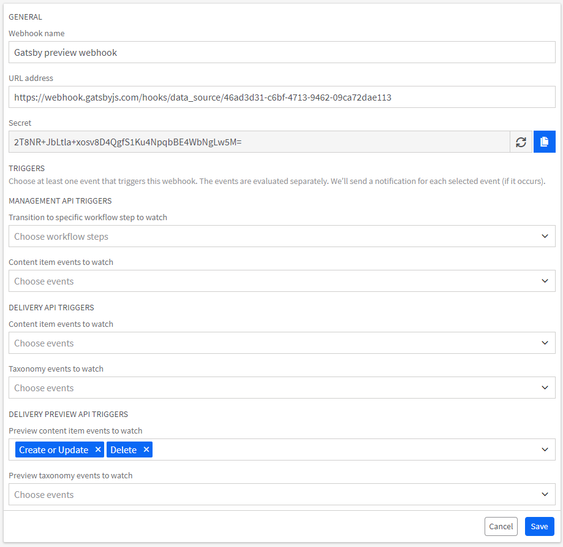

~~Click **Save**.~~

> Following webhook triggers are currently available via [API](https://docs.kontent.ai/reference/management-api-v2#operation/add-a-webhook) (use `preview_delivery_api_content_changes` as trigers section and `uspert` + `archive` as operations). **The UI and documentation is about to be released in the next iteration 05/13/2020**. (The UI is currently available on QA environment). The request would looks like that:

```sh
curl --request POST \
  --url https://manage.kontent.ai/v2/projects/<YOUR_PROJECT_ID>/webhooks \
  --header 'Authorization: Bearer <YOUR_API_KEY>' \
  --header 'Content-type: application/json' \
    --data '
{
  "name": "Example",
  "url": "https://example.com",
  "secret": "secret",
  "triggers": {
    "preview_delivery_api_content_changes": [
      {
        "type": "content_item_variant",
        "operations": [
          "archive",
          "upsert"
        ]
      }
    ]
  }
}'
```

Your Preview webhook is now ready! When you change your content in Kontent, your Gatsby Preview will update!

### Adding a Build Webhook

Navigate to your Gatsby Cloud instance and click **Site Settings**. Copy the Build Webhook on this page.

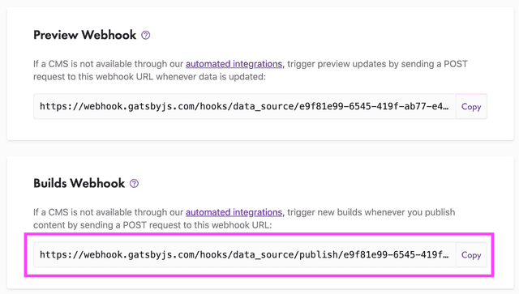

In Kentico Kontent, go to **Project settings** > **Webhooks** and click **Create new webhook**.


Name the webhook and paste the _Build webhook_ in the URL address field.

In the webhook configuration, select the _Publish_ and _Unpublish_ triggers under DELIVERY API TRIGGERS.

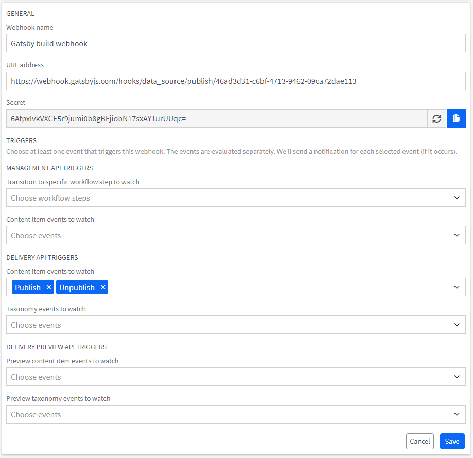

Click **Save**.

Your Build webhook is now ready! When you publish/unpublish content in Kontent, your Gatsby Build will update!

## Setting the Gatsby Preview Domain for Kontent

To open the Gatsby Cloud preview right from Kentico Kontent, you need to [configure preview URLs](https://docs.kontent.ai/tutorials/develop-apps/build-strong-foundation/set-up-preview#a-set-up-content-preview-in-your-project) for your content. The following instructions assume you're using the [`gatsby-starter-kontent-lumen`](https://github.com/Kentico/gatsby-starter-kontent-lumen) sample app.

Navigate to your Gatsby Cloud instance and click **Preview**. Copy the preview URL.

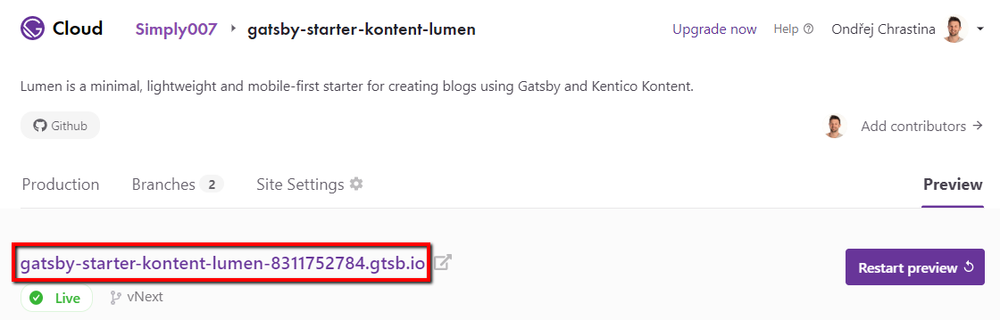

In Kentico Kontent, go to **Project settings** > **Preview URLs** and provide the URLs according to your routes configuration.

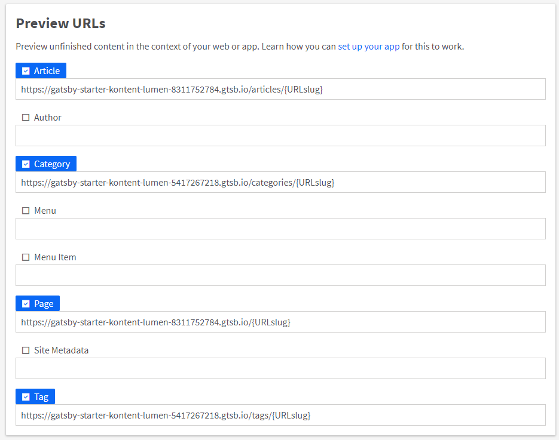

Now you can open the content preview right from Kentico Kontent UI!

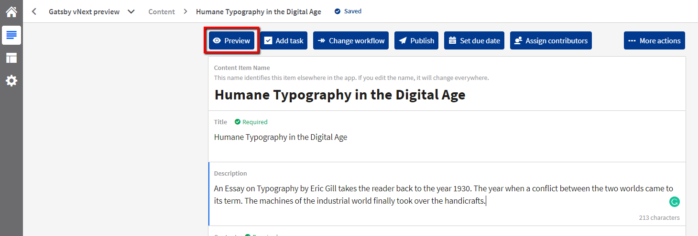

## Wrapping Up

At this point, you have a Kontent instance configured to best support Gatsby Cloud. Edit content, click the Preview button, and watch it appear live in Gatsby Cloud!
