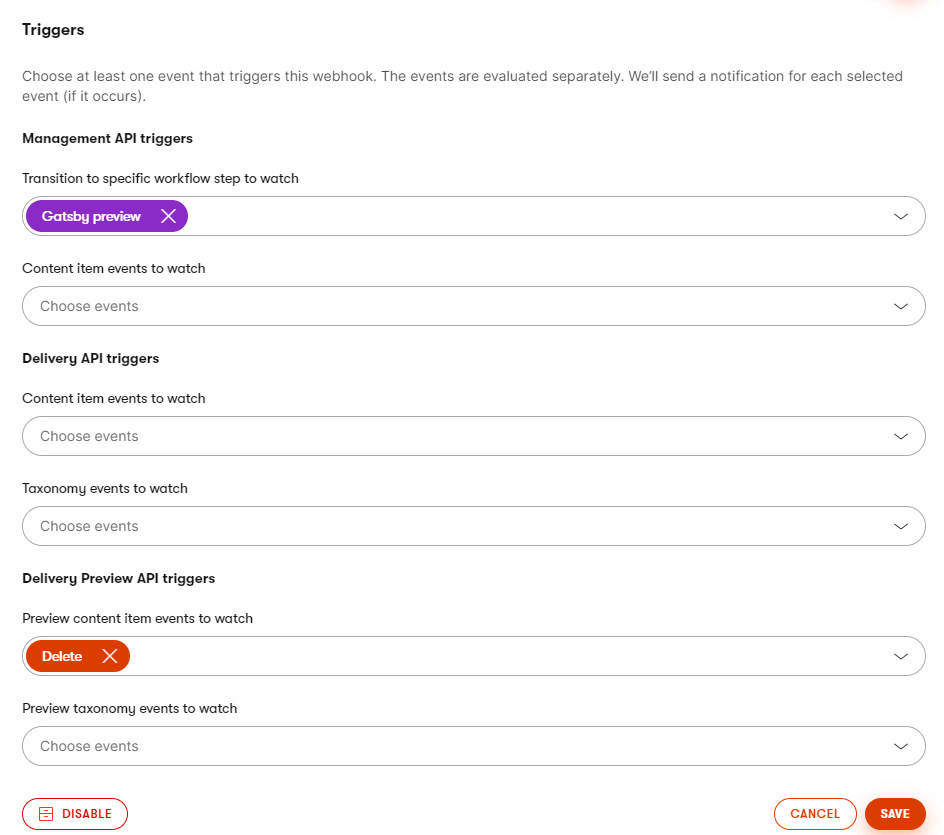

# Gatsby source plugin for Kontent.ai

[](https://www.gatsbyjs.org/packages/@kontent-ai/gatsby-source)
[](https://stackoverflow.com/tags/kontent-ai)

[](https://badge.fury.io/js/@kontent-ai%2Fgatsby-source)
[](https://www.npmjs.com/package/@kontent-ai/gatsby-source)

> To see the progress of the Gatsby v4 supported packages - [check out this pull request](https://github.com/kontent-ai/gatsby-packages/pull/195).

## Description

Source plugin for Kontent.ai REST Delivery API.

This repo contains a [Gatsby (v4) source plugin](https://www.gatsbyjs.org/docs/recipes/sourcing-data) that retrieves data from the [Kontent.ai](https://kontent.ai) REST Delivery API.

## How to install

Gatsby documentation uses `npm` for installation. This is the recommended approach for plugins as well.
This plugin does not need to use `yarn`, if want to use it in you project, see [the documentation for switching package managers](/docs/gatsby-cli/#how-to-change-your-default-package-manager-for-your-next-project).

1. Install the [@kontent-ai/gatsby-source](https://www.npmjs.com/package/@kontent-ai/gatsby-source) NPM package.

   ```sh
   npm install --save @kontent-ai/gatsby-source
   ```

1. Configure the plugin in `gatsby-config.js` file.

   ```js
   module.exports = {
     plugins: [
       {
         resolve: '@kontent-ai/gatsby-source',
         options: {
           projectId: '<ProjectID>', // Fill in your Project ID
           languageCodenames: [
             'default', // Languages in your project (Project settings -> Localization),
           ],
         },
       },
     ],
   };
   ```

## Available options

- `projectId`\* - \<`string`\> Project ID from Project settings -> API keys
- `languageCodenames`\* - \<`string[]`\> array of language codenames that defines [what languages a configured for the project](https://docs.kontent.ai/tutorials/develop-apps/get-content/getting-localized-content?tech=javascript#section-project-languages) - the first one is considered as the **default one**. Initial "Getting started" project has configured just one language `default`.
- `includeTaxonomies` - \<`boolean`\> include [taxonomies](#Querying-Kontent-Taxonomies) to GraphQL model. Turned off by default.
- `includeTypes` - \<`boolean`\> include [types](#Querying-Kontent-Types) to GraphQL model. Turned off by default.
- `authorizationKey` - \<`string`\> For preview/secured API key - depends on `usePreviewUrl` config. Consider using [dotenv](https://www.npmjs.com/package/dotenv) package for storing keys securely in environment variables.
- `usePreviewUrl` - \<`boolean`\> when `true`, "`preview-deliver.kontent.ai`" used as [primary domain for data source](https://docs.kontent.ai/reference/delivery-api#section/Production-vs.-Preview). Turned off by default.
- `proxy`:
  - `deliveryDomain` - \<`string`\> Base url used for all requests. Defaults to `deliver.kontent.ai`.
  - `previewDeliveryDomain` - \<`string`\> Base url used for preview requests. Defaults to `preview-deliver.kontent.ai`.
- `includeRawContent` - \<`boolean`\> allows to include `internal.content` property as a part fo the GraphQL model. Turned off by default.
- `experimental`:
  - `managementApiTriggersUpdate` - \<`boolean`\> allows to handle [workflow step change Management API webhook trigger](https://docs.kontent.ai/reference/webhooks-reference#a-management-api-triggers). Turned off by default.
  - `additionalItemFilterParams` - \<`string`\> Additional item [filter parameters](https://docs.kontent.ai/reference/delivery-api#tag/Filtering-content) to reduce the content in GraphQL model. Example `system.collection=marketing&system.workflow_step[neq]=archived` Empty by default.

  \* required property

### Logging

Since the plugin is using [Gatsby Reporter](https://www.gatsbyjs.org/docs/node-api-helpers/#reporter) for error logging. You could [turn on `--verbose` option](https://github.com/gatsbyjs/gatsby/pull/19199/files) to see the whole error object. Be careful with these options, the output log could contain some sensitive data such as `authorizationKey`.

## Examples of usage

An example showing how to include this plugin in a site's `gatsby-config.js` file.

```js
module.exports = {
  plugins: [
    /// ...
    {
      resolve: '@kontent-ai/gatsby-source',
      options: {
        projectId: '09fc0115-dd4d-00c7-5bd9-5f73836aee81', // Fill in your Project ID
        languageCodenames: [
          'default', // Or the languages in your project (Project settings -> Localization),
          'Another_language',
        ],
        includeTaxonomies: true, // opt-out by default
        includeTypes: true, // opt-out by default
        usePreviewUrl: true, // false by default
        authorizationKey: '<API KEY>', // for preview/secured API key - depends on `usePreviewUrl` setting - consider using environment variables to store the key securely
        includeRawContent: true, // opt-out by default - include `internal.content` property in the gatsby nodes
        proxy: {
          deliveryDomain: 'custom.delivery.kontent.my-proxy.com',
          previewDeliveryDomain: "custom.preview.delivery.kontent.my-proxy.com"
        },
        experimental: {
          managementApiTriggersUpdate: true // opt-out by default
        }
      },
    },
    /// ...
  ],
};
```

The plugin creates GraphQL nodes for all Kontent.ai taxonomies, content types, content items language variants.

The queries start with `kontentTaxonomy`, `kontentType`, or `kontentItem` prefix (respectively `allKontentTaxonomy`, `allKontentType`, or `allKontentItem`) and their type is `kontent_taxonomy_X`, `kontent_type_X`, or `kontent_item_X` where `X` is a codename of the `taxonomy`, `type`, or `item`.

> Look at the [How to query for data](#How-to-query-for-data) section for example queries.

GraphQL nodes produced by the source plugin provide the same structure as [Kontent.ai Delivery REST API](https://docs.kontent.ai/reference/delivery-api), but there are alternations for better usability, you could find more detailed description in [Delivery API alternations](#Delivery-API-alternations) section

### Learning Resources

To see upgrade instructions see [Upgrade section](./docs/UPGRADE.md).

For more developer resources, visit the [Kontent.ai Docs](https://docs.kontent.ai).

## Delivery API alternations

Some of the data from Kontent.ai Delivery API requires to be altered or extended to be usable in Gatsby. There is a list of them with its description.

### Preferred language

Besides of `system.language` every item node contains the property `preferred_language` to distinguish which language version it represents. Using this property, it is easy to distinguish whether the language fallback is used. When `preferred_language` is not the same as `system.language`, item was not translated to `preferred_language` and the delivery API returned fallback language (`system.language`).

### Linked items as links

Each _linked items_ element in **linked items element** as well as in **rich text element** is using [Gatsby GraphQL node references](https://www.gatsbyjs.org/docs/create-source-plugin/#creating-the-relationship) that can be used to traverse to the nodes linked through the use of the _Linked items_ element.

The resolution is using the `createFieldExtension` called `languageLink` that is resolving the codenames. [Embedded `@link` extension](https://www.gatsbyjs.org/docs/schema-customization/#foreign-key-fields) is not used because the links have to be resolved by `preferred_language` as well as `system.codename` equality and embedded link resolution allow using only one field to make the links out of the box.

Linked Items element

```gql
query PersonQuery {
  allKontentItemPerson {
    nodes {
      elements {
        friends {
          value {
            ... on kontent_item_person {
              id
              elements {
                name_and_surname {
                  value
                }
              }
            }
          }
        }
      }
    }
  }
}
```

Rich text element

```gql
query PersonQuery {
  allKontentItemPerson {
    nodes {
      elements {
        bio {
          modular_content { // inline linked items as well as content components
            ... on kontent_item_website {
              id
              elements {
                name {
                  value
                }
                url {
                  value
                }
              }
            }
          }
          value
        }
      }
    }
  }
}
```

### Rich text images and links

Kontent.ai REST API returns images and links for Rich Text element in the form of the object, not as an array:

```json
{
  "bio": {
    "type": "rich_text",
    "name": "Bio",
    "images": {
      "fcf07d43-46d4-46ef-a58d-c7bf7a4aecb1": {
        "image_id": "fcf07d43-46d4-46ef-a58d-c7bf7a4aecb1",
        "description": null,
        "url": "https://assets-us-01.kc-usercontent.com:443/09fc0115-dd4d-00c7-5bd9-5f73836aee81/0faa87b4-9e1e-41b8-8b38-c107cbb35147/2.jpg",
        "width": 1600,
        "height": 1065
      }
    },
    "links": {
      "59002186-1886-48f3-b8ba-6f053b5cf777": {
        "codename": "developer_community_site",
        "type": "website",
        "url_slug": ""
      }
    },
    "modular_content": [],
    "value": "..."
  }
}
```

This wrapper transforms these objects into the arrays. In case of an image the ID of the image is already stored there, in case of link, the id of a link is moved to `linked_id` property. The query then looks like:

```gql
query PersonQuery {
  allKontentItemPerson {
    nodes {
      elements {
        bio {
          images {
            # Object transformed to array
            image_id
            url
            description
            height
            width
          }
          links {
            # Object transformed to array
            codename
            type
            url_slug
            link_id # Newly generated property from object keys
          }
        }
      }
    }
  }
}
```

### Types' `elements` property

Elements property is transformed from object to array.

This is the "Website" type sample. As you can see there is `element` property, which is an object in Kontent.ai delivery REST API.

```json
{
  "system": {
    "id": "aeabe925-9221-4fb2-bc3a-2a91abc904fd",
    "name": "Website",
    "codename": "website",
    "last_modified": "2019-04-01T18:33:45.0353591Z"
  },
  "elements": {
    "url": {
      "type": "text",
      "name": "URL"
    },
    "name": {
      "type": "text",
      "name": "Name"
    },
    "description": {
      "type": "rich_text",
      "name": "Description"
    }
  }
}
```

And here is the example how the source plugin transforms the data.

Query

```gql
{
  kontentType(system: { name: { eq: "Website" } }) {
    system {
      codename
      id
      last_modified
      name
    }
    elements {
      name
      codename
      type
    }
  }
}
```

Result

```json
{
  "data": {
    "kontentType": {
      "system": {
        "codename": "website",
        "id": "aeabe925-9221-4fb2-bc3a-2a91abc904fd",
        "last_modified": "2019-04-01T18:33:45.0353591Z",
        "name": "Website"
      },
      "elements": [
        {
          "name": "URL",
          "codename": "url",
          "type": "text"
        },
        {
          "name": "Name",
          "codename": "name",
          "type": "text"
        },
        {
          "name": "Description",
          "codename": "description",
          "type": "rich_text"
        }
      ]
    }
  }
}
```

## How to query for data

This section should help you with the first queries. For further exploring it is recommended to use [GraphiQL explorer](https://www.gatsbyjs.org/docs/running-queries-with-graphiql/) available in gatsby development environment]. If you are using developer environment for the source plugin development, you could experiment according to the [How to develop locally section](#How-to-develop-locally)

### Querying Items

Example is showcasing how to query type `article`.
For rich text resolution resolution see [Rich text element component](../gatsby-components/README.md#Rich-text-element-component).
For url slug resolution see [Rich text element component](../../site/README.md#URL-slug-resolution).

```gql
query ArticleQueries {
  allKontentItemArticle(filter: { preferred_language: { eq: "en-US" } }) {
    # filtering articles in 'en-US' preferred language (see section `Preferred language` for more information)
    nodes {
      elements {
        title {
          value # title of article (text element)
        }
        content {
          # content element (rich text)
          value # plain html
          images {
            image_id
            url
            description
          }
          links {
            link_id
            url_slug
            codename
            type
          }
          modular_content {
            # inline linked items and components data
            ... on kontent_item_author {
              id
              elements {
                name {
                  value
                }
                avatar_image {
                  value {
                    url
                    description
                    name
                  }
                }
              }
            }
          }
        }
        tags {
          # tags element (linked items)
          value {
            ... on kontent_item_tag {
              elements {
                title {
                  value
                }
                slug {
                  value
                }
              }
            }
          }
        }
      }
    }
  }
}
```

### Querying Types

To query content types it is required to opt-in this in plugin configuration by using `includeTypes` option in the [configuration.](#Available-options).

```gql
query Types {
  allKontentType {
    nodes {
      Type: system {
        # system information about the type
        name
        codename
      }
      elements {
        # type's elements information
        name
        codename
        type
        options {
          # filled in case the element is multiple choice
          codename
          name
        }
        taxonomy_group # filled in case the element is taxonomy
      }
    }
  }
}
```

### Querying Taxonomies

To query content types it is required to opt-in this in plugin configuration by using `includeTypes` option in the [configuration.](#Available-options).

```gql
query Taxonomies {
  allKontentTaxonomy {
    nodes {
      system { # system information about the type
        name
        codename
      }
      terms { # taxonomy terms
        codename
        name
        terms { # terms are nested according to the model
          codename
          name
          # terms ...
        }
      }
    }
  }
}
```

## How to integrate with Gatsby Cloud

If you choose to maintain your Gatsby site on [Gatsby Cloud](https://www.gatsbyjs.com/cloud/), you will need to register two webhooks from Kontent.ai to Gatsby Cloud. Follow [the "Getting started" tutorial](https://www.gatsbyjs.com/docs/kontent/getting-started/) for more information. All webhook notifications that are not mentioned in the tutorial will be ignored by the plugin.

Once you integrate your site with Gatsby Cloud, you will be able to lavarage the new cool features as Intelligent caching, [true Incremental builds](https://www.gatsbyjs.com/cloud/docs/incremental-builds/), or [Real-time Gatsby preview](https://www.gatsbyjs.com/preview/).

> Please note that change in taxonomies or content types require a complete rebuild of the site, because these structural data affects GraphQL schema.

### Experimental workflow change handling

The source plugin is able to handle the workflow change of Kontent.ai as an experimental feature. This allows your editor in Kontent.ai to decide when to make a preview rebuild rather than automatically trigger rebuild on every auto-save event which can effectively lower the number of rebuilds in the Gatsby Cloud queue. To trigger a gatsby preview incremental build editor needs to change workflow step to the one configured in gatsby preview webhook configuration.

To allow the feature you need to:

1. Allow `managementApiTriggersUpdate` option in the [configuration](#Available-options).
2. Reconfigure your Gatsby preview webhook by registering new event to your for [Management API trigger for workflow step change](https://docs.kontent.ai/reference/webhooks-reference#a-management-api-triggers) to the step you want to react on (and remove the Preview API trigger for "Preview content item Events to watch" > "Create or Update").



> Disclaimer - since the Management API triggers should be used in combination with Management API and the source plugin is using Delivery (incl. Preview) API, there is no guarantee that the data will be up-to-date on Delivery/Preview API when Management API trigger is fired - so it can happen that in time of update (handling Management API trigger), there will be old data on Delivery Preview API.

### Gatsby preview updates

The source plugin is capable of handling [Kontent.ai Preview webhooks triggered by Delivery Preview API triggers](https://docs.kontent.ai/reference/webhooks-reference#a-delivery-preview-api-triggers). That means setting `ENABLE_GATSBY_REFRESH_ENDPOINT` environment variable to `true` opens a `/__refresh` endpoint which could be used as a target endpoint to webhook with these triggers.

If you want to trigger the whole website rebuilt, it could be done by sending a post request with an empty body. It could be useful i.e. if you want to rebuild the whole site when you are developing locally (`curl -X POST http://localhost:8000/__refresh`).

## How to use Web Spotlight with Gatsby

[Web Spotlight](https:/webspotlight.kontent.ai) is an additional tool for [Kontent.ai](https://kontent.ai/) focused on website management. Feel the power of a headless CMS while enabling your content creators to produce and update content in the context of your website.

You can find more resources about this tool in the [official documentation](https://docs.kontent.ai/tutorials/set-up-kontent/set-up-your-project/web-spotlight), in the [recording of "Sneak Peek: An introduction to Web Spotlight" webinar](https://kontent.ai/webinars/on-demand/introduction-web-spotlight), or in the blog post ["Use Web Spotlight with your existing Kontent.ai projects"](https://kontent.ai/blog/use-web-spotlight-with-your-existing-kontent-projects).

To integrate your Gatsby site with Web Spotlight, it is required to do three steps:

- Prepare the code for the Web Spotlight preview environment by decorating the HTML using [Kontent.ai Smart Link SDK](https://github.com/kontent-ai/kontent-smart-link#gatsby).
- [Turn on Web Spotlight on your Kontent.ai project](https://docs.kontent.ai/tutorials/set-up-kontent/set-up-your-project/web-spotlight#a-boost-your-web-with-web-spotlight)
- Use newly enabled features to [connect the Kontent.ai project to the preview environment](https://kontent.ai/blog/use-web-spotlight-with-your-existing-kontent-projects).

## How to run tests

The package is using [Jest](http://jest.org/) framework for testing.

To run all tests, there is an npm script prepared.

```sh
npm run test # run all tests in the repository
```

## How to develop locally

Use a [development site](../../site/README.md) in development mode. And start watch mode for this repository.

```sh
npm run watch
```

> To run complete development environment, follow the [debug section the master readme](../../README.md#development)

## Tracking usage

The package is including tracking header to the requests to Kontent.ai, which helps to identify the adoption of the source plugin and helps to analyze what happened in case of error.
If you think that tracking should be optional feel free to raise the feature or pull request.

## Further information

To see upgrade instructions see [Upgrade section](./docs/UPGRADE.md).

For more developer resources, visit the [Kontent.ai Docs](https://docs.kontent.ai).

### Running projects

- [Kentico Developer Community Site](https://kentico.github.io) [[source code](https://github.com/Kentico/kentico.github.io/tree/source)]
- [Kentico Advantage](https://advantage.kentico.com/) [[source code](https://github.com/Kentico/kentico-advantage/tree/source)]
- [Richard Shackleton's Personal portfolio and blog website](https://rshackleton.co.uk/) [[source code](https://github.com/rshackleton/rshackleton.co.uk)]
- [Untools by Adham Amran](https://untools.co) [[source code](https://github.com/amrancz/untools)]
- [Ondřej Chrastina's personal site](http://ondrej.chrastina.dev) [[source code](https://github.com/Simply007/Simply007.github.io)]
- [Aaron Collier's Czech Theather site](https://czechtheater.cz) [[source code](https://github.com/CollierCZ/czechtheater)]
- [NetConstruct agency website](https://www.netconstruct.com)
- [Matt Nield's personal blog site](https://www.mattnield.co.uk)
- [Ilesh Mistry's personal blog site](https://www.ileshmistry.com)

### Guides and blog posts

- [Sourcing from Kontent.ai](https://www.gatsbyjs.org/docs/sourcing-from-kontent/)
- [Getting started with Gatsby Cloud and Kontent.ai](https://www.gatsbyjs.com/docs/kontent/getting-started/)
- [Kontent.ai - The fastest headless CMS for Gatsby](https://kontent.ai/gatsby-cms)
- [Using Gatsby with Kontent.ai](https://www.gatsbyjs.com/guides/kentico-kontent/)
- [Rendering Kontent.ai linked content items with React components in Gatsby](https://rshackleton.co.uk/articles/rendering-kentico-cloud-linked-content-items-with-react-components-in-gatsby) by [@rshackleton](https://github.com/rshackleton)
- [Adding and retrieving localized strings from Kontent.ai to GatsbyJS and GraphQL](https://www.gatsbyjs.org/blog/2019-08-13-localised-strings-from-kentico-cloud-gatsbyjs-graphql/)
- [Automated builds with Netlify and Kontent.ai webhooks](https://rshackleton.co.uk/articles/automated-builds-with-netlify-and-kentico-cloud-webhooks) by [@rshackleton](https://github.com/rshackleton)
- [Learning about Gatsby schema customisation with Kontent.ai](https://rshackleton.co.uk/articles/learning-about-gatsby-schema-customisation-with-kontent-ai) by [@rshackleton](https://github.com/rshackleton)
- [Implementing search with Gatsby and Algolia](https://rshackleton.co.uk/articles/implementing-search-with-gatsby-and-algolia) by [@rshackleton](https://github.com/rshackleton)

> Check out the development site for some hints in the [example section](https://github.com/Kentico/kontent-gatsby-packages/tree/master/site#examples)

### Previous versions

- For version 2 see [this branch](https://github.com/kontent-ai/gatsby-packages/tree/v2).
- For version 3 see [this branch](https://github.com/kontent-ai/gatsby-packages/tree/v3).
- For version 4 see [this branch](https://github.com/kontent-ai/gatsby-packages/tree/v4).
- For version 5 see [this branch](https://github.com/kontent-ai/gatsby-packages/tree/v5).
- For version 6 see [this branch](https://github.com/kontent-ai/gatsby-packages/tree/v6).
- For version 7 see [this branch](https://github.com/kontent-ai/gatsby-packages/tree/v7).

## How to contribute

Check out the [contributing](/CONTRIBUTING.md) page to see the best places for file issues, to start discussions, and begin contributing.

> _Written according to [Gatsby plugin template](https://www.gatsbyjs.org/contributing/docs-templates/#plugin-readme-template)_
